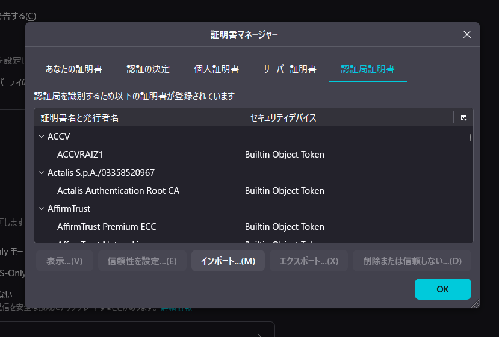

# NicoCache_nl のインストール(Linux)
<div style="text-align: right;">最終更新日：2026/03/17</div>
---

!!! note "対象ディストリビューション"
    このガイドは **Debian/Ubuntu 系** (apt) を主対象としています。  
    Fedora/RHEL 系は `apt` を `dnf` に、パッケージ名を適宜読み替えてください。

1. ターミナルを開く（`Ctrl + Alt + T` など）  
2. Eclipse Temurin OpenJDK 17・FFmpeg・p7zip をインストールする  
```bash
sudo apt update
sudo apt install -y wget apt-transport-https gnupg curl

# Eclipse Temurin リポジトリを追加
wget -O - https://packages.adoptium.net/artifactory/api/gpg/key/public \
  | sudo gpg --dearmor -o /etc/apt/keyrings/adoptium.gpg
echo "deb [signed-by=/etc/apt/keyrings/adoptium.gpg] \
  https://packages.adoptium.net/artifactory/deb \
  $(awk -F= '/^VERSION_CODENAME/{print $2}' /etc/os-release) main" \
  | sudo tee /etc/apt/sources.list.d/adoptium.list
sudo apt update
sudo apt install -y temurin-17-jdk ffmpeg p7zip-full
```
3. ホームディレクトリに `NicoCache_nl` ディレクトリを作成し、環境変数 `NICOCACHE_HOME` を設定する  
```bash
NC_DIR="$HOME/NicoCache_nl"
mkdir -p "$NC_DIR"
echo "export NICOCACHE_HOME=\"$NC_DIR\"" >> ~/.bashrc
source ~/.bashrc
```
4. Apache Ant をダウンロードし展開して `~/ant` に配置する  
```bash
# バージョンを指定
ANT_VERSION="1.10.15"
ANT_DIR="$HOME/ant"

cd /tmp
wget "https://dlcdn.apache.org//ant/binaries/apache-ant-${ANT_VERSION}-bin.tar.gz"
tar -xzf "apache-ant-${ANT_VERSION}-bin.tar.gz"
mv "apache-ant-${ANT_VERSION}" "$ANT_DIR"
```
5. 環境変数 `ANT_HOME` と `PATH` に Ant を登録する  
```bash
echo "export ANT_HOME=\"$HOME/ant\"" >> ~/.bashrc
echo 'export PATH="$ANT_HOME/bin:$PATH"' >> ~/.bashrc
source ~/.bashrc
```
6. `NicoCache_nl-2026-01-15.7z` を避難所アップローダからダウンロードして展開  
```bash
# バージョンを指定 (YYYY-MM-DD形式)
NC_VERSION="2026-01-15"
TARGET_URL="https://nicocache.jpn.org/download.php?id=19&key=514e8a406c60c969adc4ff934d5e65427cdc09c74cab334e543f7c96f80b4d81"

cd "$NICOCACHE_HOME"
wget -O "NicoCache_nl-${NC_VERSION}.7z" "$TARGET_URL"
7z x "NicoCache_nl-${NC_VERSION}.7z" -o"$NICOCACHE_HOME" -y
NESTED_DIR="$NICOCACHE_HOME/NicoCache_nl"
if [ -d "$NESTED_DIR" ]; then
    mv "$NESTED_DIR"/* "$NICOCACHE_HOME/"
    rmdir "$NESTED_DIR"
fi
```
7. BouncyCastle から依存ライブラリをダウンロードし、証明書を生成する  

!!! warning
    genCerts.sh の実行フェーズで Enter キー操作が必要な場合があります。

    誤ってターミナルを閉じないように注意！

!!! note
    `genCerts.sh` が存在しない場合は `ant genCerts` コマンドで代替できます。

```bash
# バージョンを指定
BC_VERSION="1.83"
JDK_VERSION="18"

cd "$NICOCACHE_HOME/lib"
wget "https://repo1.maven.org/maven2/org/bouncycastle/bcprov-jdk${JDK_VERSION}on/${BC_VERSION}/bcprov-jdk${JDK_VERSION}on-${BC_VERSION}.jar" -O bcprov.jar
wget "https://repo1.maven.org/maven2/org/bouncycastle/bcutil-jdk${JDK_VERSION}on/${BC_VERSION}/bcutil-jdk${JDK_VERSION}on-${BC_VERSION}.jar" -O bcutil.jar
wget "https://repo1.maven.org/maven2/org/bouncycastle/bcpkix-jdk${JDK_VERSION}on/${BC_VERSION}/bcpkix-jdk${JDK_VERSION}on-${BC_VERSION}.jar" -O bcpkix.jar
cd "$NICOCACHE_HOME"
chmod +x genCerts.sh
./genCerts.sh
cp "$NICOCACHE_HOME/config.properties.default" "$NICOCACHE_HOME/config.properties"
echo "enableMitM=true" >> "$NICOCACHE_HOME/config.properties"
```
8. 生成された CA 証明書をシステムの証明書ストアに追加する  
```bash
sudo cp "$NICOCACHE_HOME/certs/ca.cer" /usr/local/share/ca-certificates/nicocache-nl.crt
sudo update-ca-certificates
```
9. Firefox を開く  
10. 設定 > プライバシーとセキュリティ > 証明書 > 証明書を表示 > 認証局証明書 > インポート  

11. `~/NicoCache_nl/certs/ca.cer` を選択  
12. 「この認証局によるウェブサイトの識別を信頼する」にチェックを入れる  
13. Firefox を再起動する  
14. `proxy_sample.pac` から `proxy.pac` を作成  
```bash
cp "$NICOCACHE_HOME/proxy_sample.pac" "$NICOCACHE_HOME/proxy.pac"
```
15. システムのプロキシ設定で自動プロキシスクリプトを `http://localhost:8080/proxy.pac` に設定する  
**GNOME (Ubuntu 等):**  
```bash
gsettings set org.gnome.system.proxy mode 'auto'
gsettings set org.gnome.system.proxy autoconfig-url 'http://localhost:8080/proxy.pac'
```
**KDE Plasma:**  
システム設定 → ネットワーク → プロキシ → 「自動プロキシ設定スクリプトの URL」に `http://localhost:8080/proxy.pac` を入力する。  
16. その他、`config.properties` に変更したい設定があれば編集する。デフォルト設定は `defaults` ディレクトリに格納されている。  
17. ランチャースクリプトを作成する  
```bash
cat > "$NICOCACHE_HOME/run-nicocache.sh" << EOF
#!/bin/bash
cd "$NICOCACHE_HOME"
java -jar NicoCache_nl.jar &
EOF
chmod +x "$NICOCACHE_HOME/run-nicocache.sh"
```
18. `NicoCacheGUI.property` の設定を書き込む  
```bash
cat > "$NICOCACHE_HOME/NicoCacheGUI.property" << 'EOF'
HideWindow=true
LogWindowAlwaysOnTop=false
EOF
```
19. systemd ユーザーサービスとして登録してログイン時に自動起動させる  
```bash
mkdir -p ~/.config/systemd/user
cat > ~/.config/systemd/user/nicocache.service << EOF
[Unit]
Description=NicoCache_nl
After=network.target

[Service]
Type=simple
ExecStart=/bin/bash $NICOCACHE_HOME/run-nicocache.sh
Restart=on-failure

[Install]
WantedBy=default.target
EOF
systemctl --user daemon-reload
systemctl --user enable nicocache.service
systemctl --user start nicocache.service
```
20. NicoCache_nl が起動していることを確認する  
```bash
systemctl --user status nicocache.service
```
21. インストール完了。アンインストール時は以下を実行する  
```bash
systemctl --user stop nicocache.service
systemctl --user disable nicocache.service
rm -f ~/.config/systemd/user/nicocache.service
systemctl --user daemon-reload
rm -rf "$NICOCACHE_HOME"
sudo rm -f /usr/local/share/ca-certificates/nicocache-nl.crt
sudo update-ca-certificates
```
