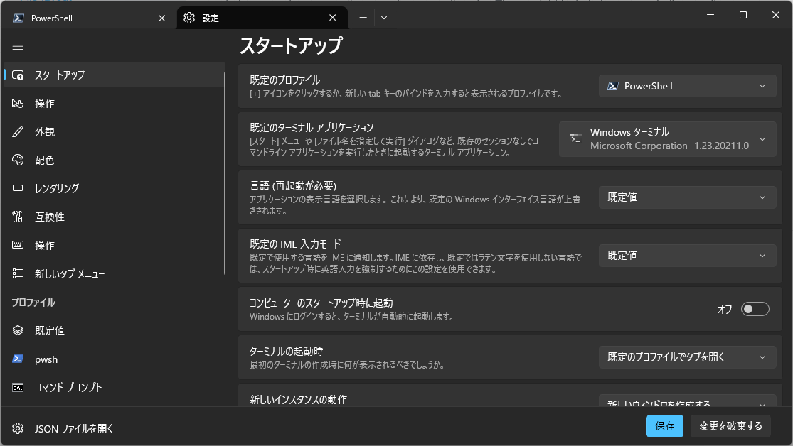

# NicoCache_nl のインストール
<div style="text-align: right;">最終更新日：2026/03/15</div>
---

1. 「Windowsキー + Rキー」を同時押しする
2. 出てきたウィンドウに「powershell」と打つ
3. ターミナルが開くのでPowershell 7 をインストールする
```powershell
winget install Microsoft.PowerShell --source winget
```
4. ターミナルを閉じる
5. 「Windowsキー」を押し、スタートメニューから「ターミナル」を開く
6. 「ターミナル」の「∨」ボタンを押し、「設定」を開き、「スタートアップ」->「デフォルトのプロファイル」を「Powershell」（Windows PowerShellではない）に変更する

7. ターミナルを再起動する（ターミナルの表示にPowershell 7.5.5のようなバージョンが表示されていればOK）
8. Cドライブ直下に`NicoCache_nl`ディレクトリを作成する
```powershell
New-Item -ItemType Directory -Path "C:\NicoCache_nl"
```
9. ターミナルでEclipse Temurin OpenJDK 17 と FFmpegをインストールする
```powershell
winget install EclipseAdoptium.Temurin.17.JDK --source winget
winget install Gyan.FFmpeg --source winget
```
10. 7-zipをインストールし、ユーザー環境変数のPathに7-zipを登録する
```powershell
winget install 7zip.7zip --source winget
[Environment]::SetEnvironmentVariable("Path", "C:\Program Files\7-Zip;$env:Path", "User")
```
11. 環境変数を適用するためターミナルを再起動する。
12. Apache Antをダウンロードし、展開し、Cドライブ直下に`ant`ディレクトリを移動
```powershell
Set-Location $env:TEMP
Invoke-WebRequest -Uri "https://dlcdn.apache.org//ant/binaries/apache-ant-1.10.15-bin.zip" -OutFile "apache-ant-1.10.15-bin.zip"
7z x "apache-ant-1.10.15-bin.zip"
Move-Item -Path "$env:TEMP\apache-ant-1.10.15" -Destination "C:\ant"
```
13. ユーザー環境変数のPathにantを登録。ANT_HOMEも登録
```powershell
[Environment]::SetEnvironmentVariable("ANT_HOME", "C:\ant", "User")
[Environment]::SetEnvironmentVariable("Path", "C:\ant\bin;$env:Path", "User")
```
14. ターミナルを再起動して環境変数を適用させる。
15. `NicoCache_nl-2026-01-15.7z`を避難所アップローダからダウンロードして展開
```powershell
Set-Location "C:\NicoCache_nl"
Invoke-WebRequest -Uri "https://nicocache.jpn.org/download.php?id=19&key=514e8a406c60c969adc4ff934d5e65427cdc09c74cab334e543f7c96f80b4d81" -OutFile "NicoCache_nl-2026-01-15.7z"
7z x "NicoCache_nl-2026-01-15.7z" -o"C:\NicoCache_nl" -y
Move-Item -Path "C:\NicoCache_nl\NicoCache_nl\*" -Destination "C:\NicoCache_nl" -Force
Remove-Item -Path "C:\NicoCache_nl\NicoCache_nl" -Recurse -Force
```
16. BouncyCastleから依存ライブラリをダウンロードし、証明書を生成、ユーザー証明書に証明書を追加 (Chromeは自動的にWindowsの証明書を参照する)

!!! warning
    genCerts.batの実行フェーズでは`pause`が入るので`Enter`等のキーボード操作が必要。

    誤ってターミナルを閉じないように注意！

    `ImportCertificate`の実行フェーズでは確認画面が出るのでOKを押して承諾する。

```powershell
Set-Location "C:\NicoCache_nl\lib"
Invoke-WebRequest -Uri "https://repo1.maven.org/maven2/org/bouncycastle/bcprov-jdk18on/1.83/bcprov-jdk18on-1.83.jar" -OutFile "bcprov.jar"
Invoke-WebRequest -Uri "https://repo1.maven.org/maven2/org/bouncycastle/bcutil-jdk18on/1.83/bcutil-jdk18on-1.83.jar" -OutFile "bcutil.jar"
Invoke-WebRequest -Uri "https://repo1.maven.org/maven2/org/bouncycastle/bcpkix-jdk18on/1.83/bcpkix-jdk18on-1.83.jar" -OutFile "bcpkix.jar"
Set-Location "C:\NicoCache_nl"
.\genCerts.bat
Copy-Item -Path "C:\NicoCache_nl\config.properties.default" -Destination "C:\NicoCache_nl\config.properties"
Add-Content -Path "config.properties" -Value "enableMitM=true"
Import-Certificate -FilePath "certs/ca.cer" -CertStoreLocation "Cert:\CurrentUser\Root"
```
17. Firefoxを開く
18. 設定 > プライバシーとセキュリティ > 証明書 > 証明書を表示 > 認証局証明書 > インポート 

19. certs/ca.cerを選択
20. 「この認証局によるウェブサイトの識別を信頼する」にチェックを入れる
21. Firefoxを再起動する
22. `proxy_sample.pac`から`proxy.pac`を作成
```powershell
Set-Location "C:\NicoCache_nl"
Copy-Item -Path "C:\NicoCache_nl\proxy_sample.pac" -Destination "C:\NicoCache_nl\proxy.pac"
```
23. その他、`config.properties`に変更したい設定があれば編集する。デフォルト設定は`defaults`ディレクトリに格納されている。
24. ランチャースクリプトを作成
```powershell
$script = @'
Set-Location -Path $PSScriptRoot
Start-Process -FilePath "javaw" -ArgumentList "-jar", "NicoCache_nl.jar"
'@
$script | Out-File -FilePath "RunNicoCache.ps1" -Encoding utf8
```
25. `NicoCacheGUI.property`の設定を書き換える
```powershell
# コピペ実行用 PowerShell スクリプト
if (!(Test-Path "NicoCacheGUI.property")) { New-Item -Path "NicoCacheGUI.property" -ItemType File -Force | Out-Null }
$props = @{}
if (Test-Path "NicoCacheGUI.property") {
    $fileContent = Get-Content "NicoCacheGUI.property" -Raw
    if ($null -ne $fileContent -and $fileContent.Trim().Length -gt 0) {
        $fileContent -split "`r?`n" | ForEach-Object {
            if ($_ -match "^\s*([^#][^=]+)=(.*)$") {
                $props[$matches[1].Trim()] = $matches[2].Trim()
            }
        }
    }
}
$props["HideWindow"] = "true"
$props["LogWindowAlwaysOnTop"] = "false"
$lines = $props.GetEnumerator() | ForEach-Object { "$($_.Key)=$($_.Value)" }
$lines | Set-Content "NicoCacheGUI.property"
```
26. ターミナルを管理者権限で起動し、以下を実行してスクリプトの実行を許可（ウィンドウにAdministratorと表示されればOK）
```powershell
Set-ExecutionPolicy RemoteSigned -Force
```
27. 管理者権限で起動したターミナルでタスクスケジューラーにランチャースクリプトを登録
```powershell
$taskName = "NicoCacheAutoStart"
$ps1Path = "C:\NicoCache_nl\RunNicoCache.ps1"
$action = New-ScheduledTaskAction -Execute "pwsh.exe" -Argument "-WindowStyle Hidden -File `"$ps1Path`""
$trigger = New-ScheduledTaskTrigger -AtLogOn
Register-ScheduledTask -TaskName $taskName -Action $action -Trigger $trigger -Description "NicoCacheをログオン時に起動するタスク" -Force
```
28. NicoCache_nlを起動
```powershell
Set-Location "C:\NicoCache_nl"
.\RunNicoCache.ps1
```
29. インストール完了。なお、アンイストール時はCドライブ直下の`NicoCache_nl`ディレクトリを削除し、タスクスケジューラーから`NicoCacheAutoStart`を削除すればOK
